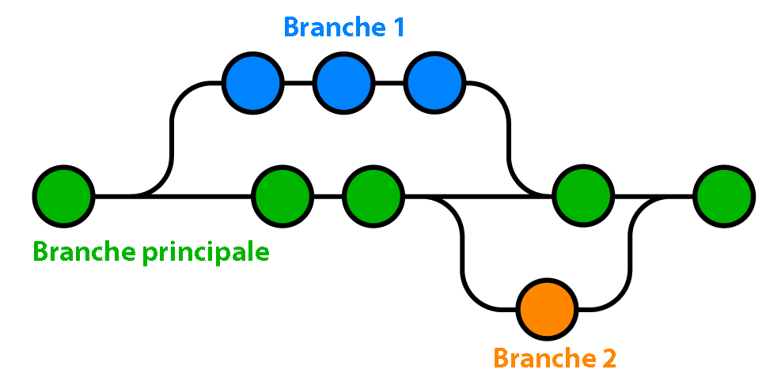

# Présentation et installation

Git est un système de contrôle de version. Cela permet de garder toutes les traces de tous les changements qui ont été opérés dans le code (qui les a fait, comment, à quelle heure...). On garde donc un historique automatique du code en permanence. Git est donc indispensable à chaque projet de développement. En plus de garder un historique du code, on peut travailler sur différentes fonctionnalités en même temps et à plusieurs.

### Exemple concret

<figure><figcaption><p>Schéma de repository</p></figcaption></figure>

La branche principale est notre site web fonctionnel. Si nous ajouter une fonctionnalité sans prendre le risque de le casser, il faut créer une nouvelle branche. Par exemple ici, la branche 1. Une branche est en fait un clone du code qui nous permet de travailler dans abîmer le vrai en cas d'erreur.

Imaginons maintenant que nous avons un bug sur notre site. Nous pouvons continuer à le modifier en même temps que la nouvelle fonctionnalité. Notre bug réglé représente le deuxième point vert. Si on a un deuxième bug, nous pouvons toujours le réglé sur la branche principale. Ici, le deuxième point vert.

À ce stade de développement, une nouvelle fonctionnalité nous vient en tête. Nous allons donc créer la branche 2 à partir du site actuel afin de développer cette fonctionnalité.

Le quatrième point vert représente la fusion de la branche principale et de la branche 1. Nous aurons dans cette version les bugs réglés de la branche principale ainsi que la nouvelle fonctionnalité.

Le dernier point vert ici représente le site final après la fusion de la version précédente (bugs réglé et fonctionnalité de la branche 1) et de la nouvelle fonctionnalité de la branche 2.

## Github

Github permet de sauvegarder (gratuitement) tout le code et donne l'accès à celui-ci n'importe où. Vous pouvez également collaborer très facilement avec d'autres personnes sur votre projet. Vous pouvez aussi travailler sur les sites open source grâce à git et Github.

Github possède un outil qui permet de régler les bugs rapidement et qui nous fera gagner notre projet en visibilité.

Github permet donc de gagner en capacité de développement, à être plus rapide, plus efficace...

## Prérequis

* Avoir un ordinateur sous Windows, MacOS ou Linux
* C'est TOUT !

Dans la formation, nous utiliserons des fichiers textes pour une meilleure compréhension de git. Même si Git est compatible avec tous les langages de développement.

## Installation de Git

Lien de téléchargement : [https://git-scm.com/downloads](https://git-scm.com/downloads)

Il existe beaucoup de moyen de télécharger Git. Prenez celui que vous préférez.

Une fois qu'il est installé, rendez-vous dans votre Terminal (MacOS et Linux) ou dans votre invite de commande / PowerShell (Windows). Tapez ensuite la commande :&#x20;

```sh
gita h
```
